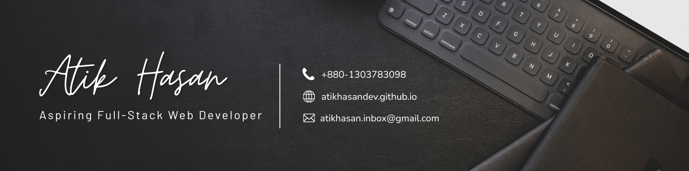

<p align="center">
  
</p>

<!--
**AtikHasanDev/AtikHasanDev** is a ✨ _special_ ✨ repository because its `README.md` (this file) appears on your GitHub profile.

Here are some ideas to get you started:

- 🔭 I’m currently working on ...
- 🌱 I’m currently learning ...
- 👯 I’m looking to collaborate on ...
- 🤔 I’m looking for help with ...
- 💬 Ask me about ...
- 📫 How to reach me: ...
- 😄 Pronouns: ...
- ⚡ Fun fact: ...
-->
<div align="center">

# Hi, I'm Atik Hasan 👋
### Aspiring Full-Stack Web Developer | MERN Stack Learner

</div>

---

## 🧑‍💻 About Me

I'm a passionate web development student on a focused journey to become a hirable junior developer. I'm currently deep in the MERN stack — building real projects from scratch to understand every layer, not just copy-paste my way through.

I believe clean code starts with strong fundamentals, so I'm taking the time to genuinely master HTML, CSS, and JavaScript before leaning on frameworks. I love collaborating with others, learning in public, and turning ideas into interfaces that actually feel good to use.

---

## 🔭 What I'm Up To

- 🌐 Building **DevConf 2026** — a full conference landing page to master CSS layout fundamentals
- ⚛️ Currently leveling up with **React** (components, props, state, hooks)
- 📚 Working through the **Programming Hero** MERN stack bootcamp
- 🎯 Building a **personal portfolio** site from scratch (no templates)
- 🔨 Practising **Git hygiene** — conventional commits, atomic changes, clean history

---

## 🛠️ Skills

<div align="center">

### Frontend


### Backend & Database *(learning)*


### Tools


</div>

---

## 📊 GitHub Stats

<div align="center">


</div>

---

## 🌐 Connect With Me

<div align="center">

[![LinkedIn](https://img.shields.io/badge/LinkedIn-0077b5?style=for-the-badge&logo=data:image/svg+xml;base64,PHN2ZyB3aWR0aD0nMjU2JyBoZWlnaHQ9JzI1NicgeG1sbnM9J2h0dHA6Ly93d3cudzMub3JnLzIwMDAvc3ZnJyBwcmVzZXJ2ZUFzcGVjdFJhdGlvPSd4TWlkWU1pZCcgdmlld0JveD0nMCAwIDI1NiAyNTYnPjxwYXRoIGQ9J00yMTguMTIzIDIxOC4xMjdoLTM3LjkzMXYtNTkuNDAzYzAtMTQuMTY1LS4yNTMtMzIuNC0xOS43MjgtMzIuNC0xOS43NTYgMC0yMi43NzkgMTUuNDM0LTIyLjc3OSAzMS4zNjl2NjAuNDNoLTM3LjkzVjk1Ljk2N2gzNi40MTN2MTYuNjk0aC41MWEzOS45MDcgMzkuOTA3IDAgMCAxIDM1LjkyOC0xOS43MzNjMzguNDQ1IDAgNDUuNTMzIDI1LjI4OCA0NS41MzMgNTguMTg2bC0uMDE2IDY3LjAxM1pNNTYuOTU1IDc5LjI3Yy0xMi4xNTcuMDAyLTIyLjAxNC05Ljg1Mi0yMi4wMTYtMjIuMDA5LS4wMDItMTIuMTU3IDkuODUxLTIyLjAxNCAyMi4wMDgtMjIuMDE2IDEyLjE1Ny0uMDAzIDIyLjAxNCA5Ljg1MSAyMi4wMTYgMjIuMDA4QTIyLjAxMyAyMi4wMTMgMCAwIDEgNTYuOTU1IDc5LjI3bTE4Ljk2NiAxMzguODU4SDM3Ljk1Vjk1Ljk2N2gzNy45N3YxMjIuMTZaTTIzNy4wMzMuMDE4SDE4Ljg5QzguNTgtLjA5OC4xMjUgOC4xNjEtLjAwMSAxOC40NzF2MjE5LjA1M2MuMTIyIDEwLjMxNSA4LjU3NiAxOC41ODIgMTguODkgMTguNDc0aDIxOC4xNDRjMTAuMzM2LjEyOCAxOC44MjMtOC4xMzkgMTguOTY2LTE4LjQ3NFYxOC40NTRjLS4xNDctMTAuMzMtOC42MzUtMTguNTg4LTE4Ljk2Ni0xOC40NTMnIGZpbGw9JyNmZmYnLz48L3N2Zz4K)](https://linkedin.com/in/atikhasan-)
[](https://facebook.com/atikhasan.facebook)
[](https://instagram.com/__atik_hasan___)
[](mailto:atikhasan.inbox@gmail.com)

</div>

---

<div align="center">

```
              ╔══════════════════════════════════════════════════════════════╗
              ║                                                              ║
              ║   > whoami                                                   ║
              ║   Atik Hasan — Aspiring Full-Stack Developer                 ║
              ║                                                              ║
              ║   > status                                                   ║
              ║   Learning · Building · Growing                              ║
              ║                                                              ║
              ╚══════════════════════════════════════════════════════════════╝
```

</div>

<div align="center">
  <i>"First, solve the problem. Then, write the code." — John Johnson</i>
</div>
